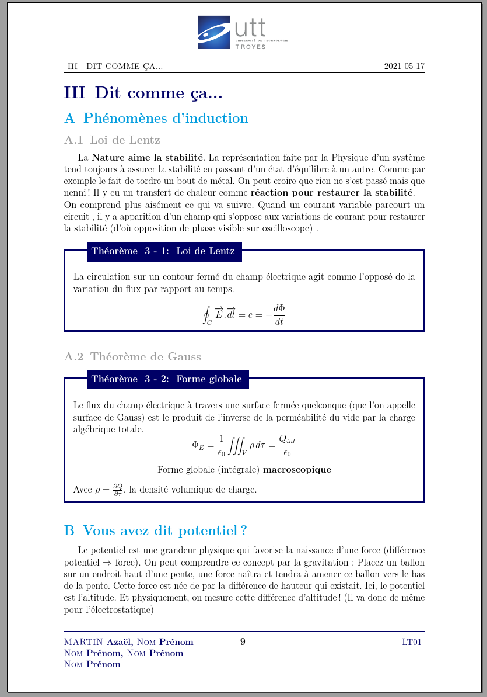
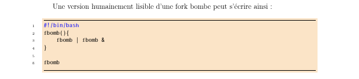
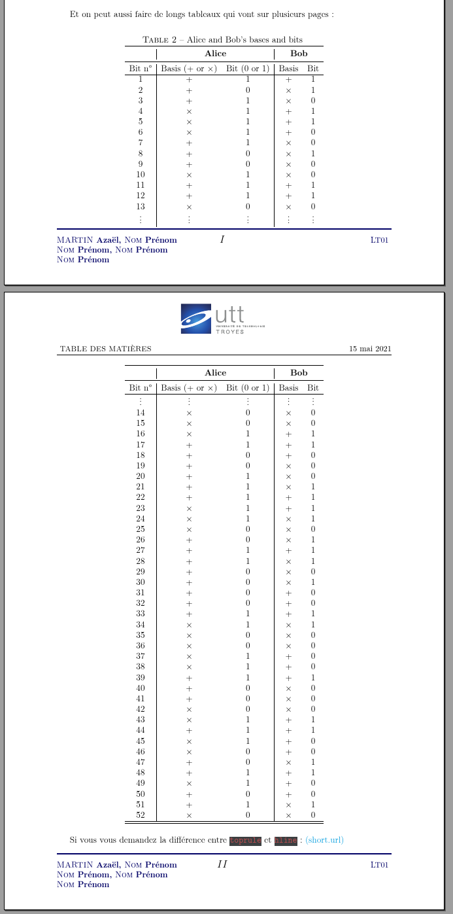
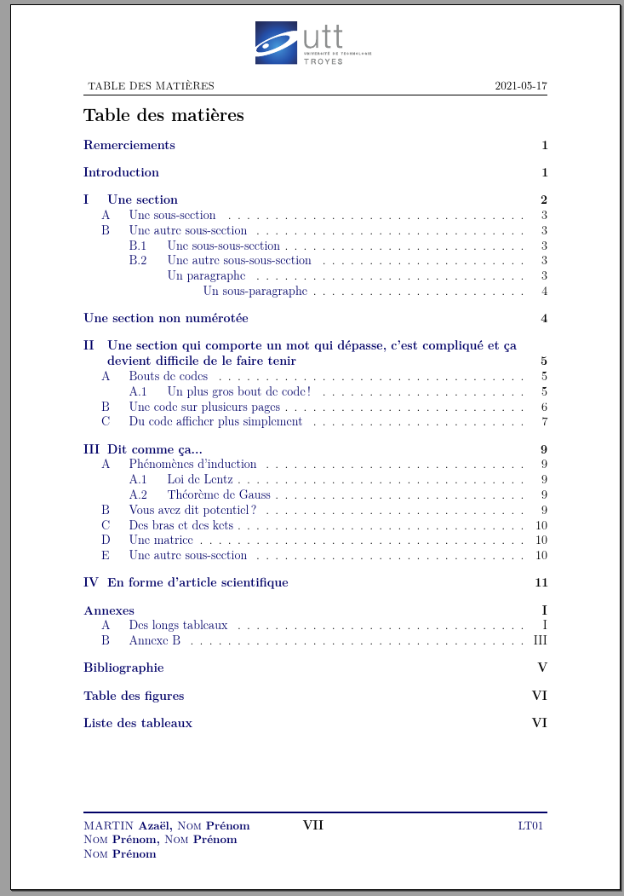

<p align="center">
  
</p>

`ScribUTT`: rapport au format [UTT](https://www.utt.fr/) pour la rédaction de vos rapports de TPs / TDs / Projets mais aussi pour les stages (ST05,ST09,ST10,ST30).

---

Pour que les gens qui lisent vos rapports puissent réagir ainsi :
<p align="center">
  
</p>

---

Le pdf d'exemple généré est disponible [ici](rapportUTT.pdf).


# Table des matières
- [`ScribUTT`: rapport au format UTT.](#scributt-rapport-au-format-utt)
- [Utilisation](#utilisation)
  - [Bivalance](#bivalance)
  - [Utilisation du make](#utilisation-du-make)
  - [Architecture de votre projet](#architecture-de-votre-projet)
  - [Commandes en plus](#commandes-en-plus)
- [Prévisualisation](#prvisualisation)
- [Comment gerer un gros projet en LaTeX](#comment-gerer-un-gros-projet-en-latex)
  - [Comment incorpore-t-on d'autres fichiers ?](#comment-incorpore-t-on-dautres-fichiers-)
- [Bibliographie](#bibliographie)
  - [Biber et BibTex](#biber-et-bibtex)
- [Des liens utiles](#des-liens-utiles)
- [Petits soucis](#petits-soucis)
- [Licence](#licence)
- [Contribution](#contribution)

# Utilisation
**Pour une utilisation simple, ne téléchargez pas directement tout le repository !**
Téléchargez l'archive prête à être utilisée : [ici](deploy/latex-rapport-UTT.zip) !

## Bivalence
* Ce projet vous permet de rédiger **tous** vos rapports UTT !
En ouvrant le [rapportUTT.tex](rapportUTT.tex), vous verrez que j'ai tout commenté pour que vous sachiez quoi remplir en fonction. J'ai aussi mis à disposition sur ce git le [Thésaurus de l'UTT](Ressources-graphiques/Thésaurus.pdf) de 2021 qui je pense, ne bougera que très peu dans le temps.

* Si jamais vous souhaitez modifier la langue du rapport de stage, pour éviter de créer deux fichiers .tex, je vous conseille juste de vous rendre dans [frontpage_ST.tex](src/packages/frontpage_ST.tex) et de remplacer quelques variables :
```
    % Mots clés (Thésaurus)
    \begin{textblock*}{7.8cm}(12cm,20cm)
        \normalsize
        \begin{center}
            \textbf{\textcolor{white}{Mots clés (cf Thésaurus) :}}
        \end{center}
    \end{textblock*}
```
En
```
    % Mots clés (Thésaurus)
    \begin{textblock*}{7.8cm}(12cm,20cm)
        \normalsize
        \begin{center}
            \textbf{\textcolor{white}{Key words (cf Thésaurus) :}}
        \end{center}
    \end{textblock*}
```

## Utilisation du make
Sous un environnement Unix, vous pouvez utiliser le `MAKEFILE` pour :

* Construire le pdf de votre projet avec `make` 
* Déployer votre rapport sous une forme dite "propre" (i.e. le pdf et un zip propre de vos ressources) avec `make deploy`. Notez qu'il invoque par lui même la construction du pdf.
* Nettoyer votre espace de projet avec `make clean` et/ou `make clean all`.

## Architecture de votre projet
* La classe [rUTT](rUTT.cls) est la classe mère dans laquelle est défini toutes les subtilités tel que les paramètres de [`minted`](https://ctan.org/pkg/minted?lang=en), les mises en forme du bas de page etc.

* Le fichier [rapportUTT.tex](rapportUTT.tex) est la racine de votre projet, c'est ici que vous allez renseigner le titre, votre UE, les auteurs etc. **Le corps de ce document a été conçu pour aller au plus simple**, vous n'avez qu'à changer l'ordre d'import de vos parties, sauter des pages (ou non) entre chacune d'elle etc.

Ensuite, on part dans la branche [src](src) : 

* On placera dans le dossier [contents](src/contents) toutes les images que l'on souhaite incorporer à notre document.
* Le dossier [packages](src/packages) contient les ajouts de commandes les plus usées ["commands.sty"](src/packages/commands.sty), les couleurs de l'UTT [ici](src/packages/couleurs_UTT.sty) mais aussi et surtout la conception de la page de garde avec l'*overlay* et [la disposition des éléments](src/packages/frontpage.tex). **C'est ici qu'il faut ajouter vos modules perso**. N'hésitez pas à proposer un module que vous jugez essentiel !
* S'en suit la branche ["parts"](src/parts) dans laquelle j'ai réservé un emplacement exprès pour placer les [codes sources](src/parts/code) à afficher dans votre rapport. Ainsi que toutes les parties de votre document (e.g., ["firstPart"](src/parts/firstPart.tex)) !
## Commandes en plus
* J'ai ajouté une commande permettant d'afficher une adresse en hyperlink, permettant de cliquer directement dessus pour afficher sur une carte openstreetmap.
```
\newcommand{\mapAddr}[1]{\href{https://www.openstreetmap.org/search?query=#1}{#1}}
```
C'est utilisé pour la section "Lieu" de votre rapport de stage !

* Beaucoup de commandes très utilisées sont mises dans le package [commands.sty](src/packages/commands.sty). N'hésitez pas à m'en fournir d'autres que vous souhaiteriez voir apparaitre !
# Prévisualisation
La page de garde des rapports (TPs,TDs,projets) a été configurée pour s'afficher ainsi :
<p align="center">
  
</p>
Celle pour les rapports de stage :
<p align="center">
  
</p>
Voici un exemple d'une mise en page contenant un énoncé de théorème :
<p align="center">
  
</p>
Un exemple d'insertion de code :
<p align="center">
  
</p>
Un exemple d'insertion d'un long tableau:
<p align="center">
  
</p>
Et voici à quoi ressemble la bibliographie :
<p align="center">
  
</p>

Je vous laisse découvrir le reste dans le [pdf de présentation](rapportUTT.pdf).

# Comment gerer un gros projet en LaTeX
## Comment incorpore-t-on d'autres fichiers ?

`\input{nom_de_fichier}` importe les commandes de `nom_de_fichier.tex` dans le fichier cible -cela équivaut à taper toutes les commandes de `nom_de_fichier.tex` directement dans le fichier courant à l'endroit de la ligne `\input`.

`\include{nom_de_fichier}` effectue essentiellement un `\clearpage` avant et après `\input{nom_de_fichier}`, ainsi qu'un petit tour de passe passe pour passer à un autre fichier `.aux`. Il omet aussi l'inclusion si vous on a un `\includeonly` sans le nom de fichier en argument.

C'est très utile lorsqu'on a un gros projet sur un ordinateur lent - **changer une des cibles d'inclusion n'oblige pas à régénérer les sorties de toutes les autres**.

`\include{nomdefichier}` donne non seulement un bonus de vitesse mais il peut en plus ne pas être imbriqué, ne pas apparaître dans le préambule, et forcer les sauts de page autour du texte inclus.

---

Concernant quand les utiliser, `\include` est généralement utilisé pour placer chaque chapitre d'un livre / d'une thèse / d'un devoir dans son propre fichier ! 

On ne peut pas "précompiler" des parties. Néanmoins, on peut utiliser `\includeonly` pour s'assurer que nos références croisées et nos numéros de pages restent corrects tout en choisissant de n'inclure que certaines parties de nos sources.

---

### Le package `import`

Bon, c'est vrai, `\input` et `\include` sont les outils de base pour incorporer d'autres fichiers `LaTeX` dans un autre. Sauf qu'il existe un package qui permet d'éviter bon nombre d'erreurs dû à ces derniers.

Le `\clearpage` est à faire manuellement ici !

# Bibliographie

On ne peut pas utiliser et `thebibliography` et `biblatex` en même temps. `thebibliography` nous donne un contrôle **total** sur l'ensemble de la bibliographie mais il faut tout faire manuellement. Tandis que `biblatex` peut créer automatiquement la bibliographie pour nous si on lui fournit un fichier `.bib` !

Pour plus d'informations sur la gestion de la bibliographie, on peut consulter le wikibook suivant : [https://en.wikibooks.org/wiki/LaTeX/Bibliography_Management](https://en.wikibooks.org/wiki/LaTeX/Bibliography_Management)

Si on veut utiliser `biblatex` on enlève `thebibliography`, on créé un fichier `.bib` et on affiche la bibliographie avec `\printbibliography` . ⇒ [https://tex.stackexchange.com/questions/13509/biblatex-in-a-nutshell-for-beginne](https://tex.stackexchange.com/questions/13509/biblatex-in-a-nutshell-for-beginners)

## Biber et BibTex

`BibTex` est l'ancien et (malheureusement) bien souvent le moteur par défaut des éditeurs LaTeX tandis que `Biber` est le "nouveau"  (i.e., 2009) logiciel qui est évolutif, souple (on peut gérer un panel de fonctionnalités avec un seul package) et "facilement" personnalisable. En somme, il est bien mieux adapté à des bibliographies complexes.

On pratique la **quadruple compilation** : `latex -> biber -> latex*2`

Si vous souhaitez vous plonger là-dedans, il y a un très bon pdf téléchargeable [ici](https://www.google.com/url?sa=t&rct=j&q=&esrc=s&source=web&cd=&ved=2ahUKEwie5OTx05vwAhWNxoUKHeyAAWMQFjAAegQIAhAD&url=https%3A%2F%2Fgeekographie.maieul.net%2FIMG%2Fpdf%2Fbiblatex-biber.pdf&usg=AOvVaw0-Aij8srvxZyquveQ_tbtA).

- Ne faites pas la même erreur que moi !

    A vouloir intégrer `biber` au sein de mon éditeur LaTeX (VsCode), j'ai modifié le fichier `.json` mais à chaque mise à jour, je me devais de le remodifier (cf [cette issue GitHub](https://github.com/James-Yu/LaTeX-Workshop/issues/1931) similaire à mon souci).

    `latexmk` prend en charge tout seul l'existence d'une instance biber ou non !

    Il est compris de base dans l'extension LaTeX de VsCode. Sinon, voici la documentaiton pour tout autre système : [https://mg.readthedocs.io/latexmk.html](https://mg.readthedocs.io/latexmk.html)


# Des liens utiles
* Pour écrire des maths en LaTeX: [ici](https://fr.wikibooks.org/wiki/LaTeX/%C3%89crire_des_math%C3%A9matiques)
* Pour mettre en forme du code avec [minted](https://github.com/gpoore/minted): [ici](https://github.com/gpoore/minted/raw/master/source/minted.pdf)
* Un pdf très complet écrit par Monsieur Bouzygues Adrien est téléchargeable [ici](https://www.google.com/url?sa=t&rct=j&q=&esrc=s&source=web&cd=&cad=rja&uact=8&ved=2ahUKEwibkNn4ndXvAhUIlxQKHXU8CMYQFjAMegQIIBAD&url=http%3A%2F%2Ftug.ctan.org%2Finfo%2Fguide-latex-fr%2Fguide-latex-fr.pdf&usg=AOvVaw0BYYptHIaSenpCbfa5-vLy)
* Quel police d'écriture choisir pour son code: [ici](https://www.google.com/url?sa=t&rct=j&q=&esrc=s&source=web&cd=&ved=2ahUKEwiZo_zqtNXvAhXaAWMBHTY8C6kQFjAFegQICxAD&url=https%3A%2F%2Fwww.latex-project.org%2Fhelp%2Fdocumentation%2Ffntguide.pdf&usg=AOvVaw045dBXCgGLgwcHtVSLxBMm)
* Pour transposer vos tableaux Excel (et autres) en format LaTeX : [ici](https://www.tablesgenerator.com/latex_tables)
* Pour bien intégrer des liens aussi bien vers vos fichiers que vers des URLs : [ici](https://en.wikibooks.org/wiki/LaTeX/Hyperlinks)
* Si vous préférez coller votre code sous forme d'image, il y a ce cite qui est excellent: https://carbon.now.sh/
# Petits soucis
* "J'ai un problème, mon compilateur me dit : ```! LaTeX Error: File `algorithm2e.sty' not found.``` !"
> Veillez à avoir le package `algorithm2e.sty` provenant de `texlive-science`. <br/>

* "Et pour ```! Package minted Error: You must have `pygmentize' installed to use this package.``` ?"
> On ouvre une invite de commande et on lance: `pip install Pygments`

# Licence
Ce contenu est distribué sous licence BSD-3. **Attention l'archive dont nous parlons au-dessus contient des éléments graphiques dont certains sont de la propriété de l'[Université de Technologie de Troyes](https://www.utt.fr/).**

# Contribution
Toute contribution est la bienvenue.
