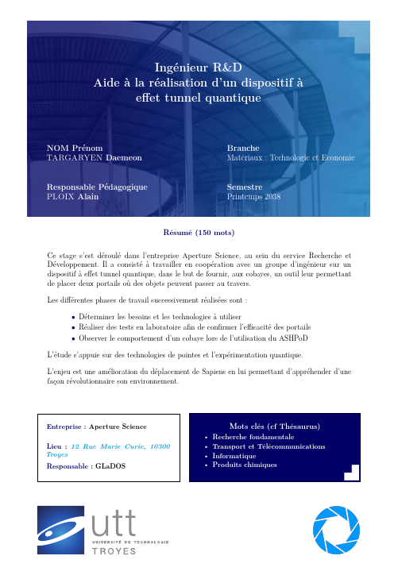

# Scrib'UTT

<p align="center">
  
</p>

`ScribUTT`: Template LaTeX **perfectionniste** au format [UTT](https://www.utt.fr/) pour la rédaction de vos rapports de TPs / TDs / Projets,
mais aussi pour les stages (ST05,ST09,ST10,ST30). Parce qu'un ingénieur ne devrait pas avoir à se soucier de la forme de son rapport.

---

Pour que les gens qui lisent vos rapports puissent réagir ainsi :
<p align="center">
  
</p>

:star: Laissez une étoile sur ce projet s'il vous a servi ! :arrow_right:  :arrow_left:

---

Voici la couverture que vous obtiendrez en utilisant ce projet :

<p align="center">
  
</p>

## Utilisation

**Pour une utilisation simple, ne téléchargez pas directement tout le repository !**
Téléchargez [l'archive prête à être utilisée](https://nightly.link/n3rada/ScribUTT/workflows/deploy.yaml/main/deploy.zip).

## Bivalence

* Ce projet vous permet de rédiger **tous** vos rapports UTT !
  En ouvrant le [rapportUTT.tex](rapportUTT.tex), vous verrez que j'ai tout commenté pour que vous sachiez quoi remplir en fonction. J'ai aussi mis à disposition sur ce git le
  [Thésaurus de l'UTT](ressources-graphiques/Thésaurus.pdf) de 2021 qui je pense, ne bougera que très peu dans le temps.

Pour passer d'une page de garde à l'autre, veillez à bien commenter / dé-commenter le bon appel de la page de garde correspondante (dans [rapportUTT.tex](rapportUTT.tex)).

* Si jamais vous souhaitez modifier la langue du rapport de stage, pour éviter de créer deux fichiers .tex, je vous conseille juste de vous rendre dans
  [frontpage_STB.tex](packages/frontpage_STB.tex) par exemple (pour le modèle de rapport de stage des Branches / Master) et de remplacer les variables adéquates.

## Utilisation du make

Sous un environnement Unix, vous pouvez utiliser le `MAKEFILE` pour :

* Construire le pdf de votre projet avec `make`
* Déployer votre rapport sous une forme dite "propre" (i.e. le pdf et un zip propre de vos ressources) avec  
  `make deploy`. Notez qu'il invoque par lui-même la construction du pdf.
* Nettoyer votre espace de projet avec `make clean` et/ou `make clean all`.

## Architecture de votre projet

* La classe [rUTT](rUTT.cls) est la classe mère dans laquelle sont définies toutes les subtilités telles que les paramètres de [`minted`](https://ctan.org/pkg/minted?lang=en),
  les mises en forme du bas de page, etc.

* Le fichier [rapportUTT.tex](rapportUTT.tex) est la racine de votre projet, c'est ici que vous allez renseigner le titre, votre UE, les auteurs, etc.
  **Le corps de ce document a été conçu pour aller au plus simple**, vous n'avez qu'à changer l'ordre d'import de vos parties, sauter des pages (ou non) entre chacune d'elle, etc.
* On placera dans le dossier [assets/img](assets/img) toutes les images que l'on souhaite incorporer à notre document.
* Le dossier [packages](packages) contient les ajouts de commandes les plus usées ["commands.sty"](packages/commands.sty), les couleurs de l'UTT [ici](packages/couleurs_UTT.sty),
  mais aussi et surtout la conception de la page de garde avec l'*overlay* et [la disposition des éléments](packages/frontpage_STB.tex)
  (encore une fois avec pour exemple le modèle de rapport de stage des Branches / Master). **C'est ici qu'il faut ajouter vos modules perso**.
  N'hésitez pas à proposer un module que vous jugez essentiel !

### Sommaire et Table des matières

Selon les règles d'organisation d'un document en français, un sommaire et une table des matières sont **deux choses bien différentes**.

* La Table des matières donne **le détail de tous les chapitres, sections, sous-sections, etc.** Elle se place **en toute fin de document (après la bibliographie)** pour être facilement accessible.
  C'est elle qui **porte les numéros de pages et mentionne ce qu'on appelle l'appareil de référence (annexes, tables, index, bibliographie, etc.)**

* Le Sommaire quant à lui se place juste avant le début du texte principal et ne **donne** que **des informations sommaires, à savoir les parties, chapitres et grandes subdivisions du mémoire ou
  rapport (de stage)**. Le sommaire doit apparaître après votre résumé ou vos remerciements, mais avant vos listes des illustrations/abréviations et le glossaire, ou juste avant l'introduction.

## Commandes en plus

* J'ai ajouté une commande permettant d'afficher une adresse en hyperlink, permettant de cliquer directement dessus pour afficher sur une carte OpenStreetMap.

```
\newcommand{\mapAddr}[1]{\href{https://www.openstreetmap.org/search?query=#1}{#1}}
```

C'est utilisé pour la section "Lieu" de votre rapport de stage !

* Beaucoup de commandes très utilisées sont mises dans le package [commands.sty](packages/commands.sty). N'hésitez pas à m'en fournir d'autres que vous souhaiteriez voir apparaitre !

## Comment gerer un gros projet en LaTeX

### Comment incorpore-t-on d'autres fichiers ?

`\input{nom_de_fichier}` importe les commandes de `nom_de_fichier.tex` dans le fichier cible -cela équivaut à taper toutes les commandes de `nom_de_fichier.tex`
directement dans le fichier courant à l'endroit de la ligne `\input`.

`\include{nom_de_fichier}` effectue essentiellement un `\clearpage` avant et après `\input{nom_de_fichier}`, ainsi qu'un petit tour de passe-passe pour passer à un autre fichier `.aux`.
Il omet aussi l'inclusion si on a un `\includeonly` sans le nom de fichier en argument.

C'est très utile lorsqu'on a un gros projet sur un ordinateur lent - **changer une des cibles d'inclusion n'oblige pas à régénérer les sorties de toutes les autres**.

`\include{nomdefichier}` donne non seulement un bonus de vitesse, mais il peut en plus ne pas être imbriqué, ne pas apparaître dans le préambule,
et forcer les sauts de page autour du texte inclus.

---

Concernant quand les utiliser, `\include` est généralement utilisé pour placer chaque chapitre d'un livre / d'une thèse / d'un devoir dans son propre fichier !

On ne peut pas "précompiler" des parties. Néanmoins, on peut utiliser `\includeonly` pour s'assurer que nos références croisées et nos numéros de pages restent corrects
tout en choisissant de n'inclure que certaines parties de nos sources.

---

#### Le package `import`

Bon, c'est vrai, `\input` et `\include` sont les outils de base pour incorporer d'autres fichiers `LaTeX` dans un autre.
Sauf qu'il existe un package qui permet d'éviter bon nombre d'erreurs dû à ces derniers.

Le `\clearpage` est à faire manuellement ici !

## Bibliographie

On ne peut pas utiliser et `thebibliography` et `biblatex` en même temps. `thebibliography` nous donne un contrôle **total** sur l'ensemble de la bibliographie, mais il faut tout faire manuellement.
Tandis que `biblatex` peut créer automatiquement la bibliographie pour nous si on lui fournit un fichier `.bib` !

Pour plus d'informations sur la gestion de la bibliographie, on peut consulter le wikibook
suivant : [https://en.wikibooks.org/wiki/LaTeX/Bibliography_Management](https://en.wikibooks.org/wiki/LaTeX/Bibliography_Management)

Si on veut utiliser `biblatex` on enlève `thebibliography`, on crée un fichier `.bib` et on affiche la bibliographie
avec `\printbibliography` . ⇒ [https://tex.stackexchange.com/questions/13509/biblatex-in-a-nutshell-for-beginne](https://tex.stackexchange.com/questions/13509/biblatex-in-a-nutshell-for-beginners)

## Biber et BibTex

`BibTex` est l'ancien et (malheureusement) bien souvent le moteur par défaut des éditeurs LaTeX tandis que `Biber` est le "nouveau" (i.e., 2009) logiciel qui est évolutif, souple (on peut gérer un
panel de fonctionnalités avec un seul package) et "facilement" personnalisable. En somme, il est bien mieux adapté à des bibliographies complexes.

On pratique la **quadruple compilation** : `latex -> biber -> latex*2`

Si vous souhaitez vous plonger là-dedans, il y a un très bon pdf téléchargeable [ici](https://geekographie.maieul.net/IMG/pdf/biblatex-biber.pdf).

- Ne faites pas la même erreur que moi !

  À vouloir intégrer `biber` au sein de mon éditeur LaTeX (VsCode), j'ai modifié le fichier `.json` mais à chaque mise à jour, je me devais de le modifier de nouveau
  (cf. [cette issue GitHub](https://github.com/James-Yu/LaTeX-Workshop/issues/1931) similaire à mon souci).

  `latexmk` prend en charge tout seul l'existence d'une instance biber ou non !

  Il est compris de base dans l'extension LaTeX de VsCode. Sinon, voici la documentation pour tout autre système : [https://mg.readthedocs.io/latexmk.html](https://mg.readthedocs.io/latexmk.html)

## Des liens utiles

* Pour écrire des maths en LaTeX :
  [ici](https://fr.wikibooks.org/wiki/LaTeX/%C3%89crire_des_math%C3%A9matiques)
* Pour mettre en forme du code avec [minted](https://github.com/gpoore/minted) :
  [ici](https://github.com/gpoore/minted/raw/master/source/minted.pdf)
* Un pdf très complet écrit par Monsieur Bouzigues Adrien est téléchargeable
  [ici](https://tug.ctan.org/info/guide-latex-fr/guide-latex-fr.pdf)
* Quelle police d'écriture choisir pour son code :
  [ici](https://www.latex-project.org/help/documentation/fntguide.pdf)
* Pour transposer vos tableaux Excel (et autres) en format LaTeX :
  [ici](https://www.tablesgenerator.com/latex_tables)
* Pour bien intégrer des liens aussi bien vers vos fichiers que vers des URLs :
  [ici](https://en.wikibooks.org/wiki/LaTeX/Hyperlinks)
* Si vous préférez coller votre code sous forme d'image, il y a ce site qui est excellent :
  https://carbon.now.sh/

## Installation

On essaie de regrouper ici toutes les installations au propre pour chaque cas.
Merci de faire parvenir via une pull-request ou en envoyant un message privé les erreurs ou ajouts.

### Dépendances Python

* Pour éviter l'erreur : ```! Package minted Error: You must have `pygmentize' installed to use this package.```

> On ouvre une invite de commande et on lance: `pip3 install Pygments`

### Linux

```bash
sudo apt update && sudo apt install texlive texlive-science texlive-latex-extra latexmk texlive-lang-french texlive-bibtex-extra biber -y
```

#### openSUSE

1. On utilise `zypper` avec l'option `--no-recommends` pour installer le moins de dépendances possible.
2. On crée un lien symbolique pour `Pygments`: `sudo ln -sf /usr/bin/python3.8 /usr/bin/python`
3. On procède à l'installation de LaTeX et ses dépendances (320~) :

    ```sh
    `sudo zypper in --no-recommends texlive-latexmk texlive-emptypage texlive-setspace texlive-soul texlive-datetime2 texlive-bookmark texlive-microtype texlive-floatrow texlive-titling texlive-blindtext texlive-adjustbox texlive-subfiles texlive-animate texlive-ulem texlive-multirow texlive-mathtools texlive-todonotes texlive-enumitem texlive-psnfss texlive-textpos texlive-frankenstein texlive-quoting texlive-epigraph texlive-minted texlive-tcolorbox texlive-csquotes texlive-mdframed texlive-braket texlive-titlesec texlive-appendix texlive-tocloft texlive-etoc texlive-shorttoc texlive-fancyhdr texlive-bigfoot texlive-biber-bin texlive-babel-french texlive-babel-english texlive-censor texlive-hyperxmp`
    ```

4. Si vous utilisez `vim` ou `neovim` :

* On installe `texlive-texcount` pour compter le nombre de mots avec le plugin [VimTeX](https://github.com/lervag/vimtex)
* On peut aussi installer `texlive-chktex` pour des diagnostiques LSP en utilisant le plugin [null-ls](https://github.com/jose-elias-alvarez/null-ls.nvim) (`neovim` seulement)

## Petits soucis

* "J'ai un problème, mon compilateur me dit : ```! LaTeX Error: File `algorithm2e.sty' not found.``` !"

> Veillez à avoir le package `algorithm2e.sty` provenant de `texlive-science`. <br/>

* L'erreur `minted Error: You must invoke LaTeX with the `-shell-escape` flag`

> Ce souci est présent sur TeXStudio et est résolvable en faisant les changements
> indiqués [ici](https://tex.stackexchange.com/questions/99475/how-to-invoke-latex-with-the-shell-escape-flag-in-texstudio-former-texmakerx), ou pour les plus pressés, rendez-vous
> dans `Options > Configure TeXStudio > Build` et dans la boite de dialogue **User Commands**, cliquez sur `+Add` et nommé votre commande puis mettez respectivement `user:graphviz-pdflatex`
> et `txs:///pdflatex/[--shell-escape]`.

* Lors de l'impression, le pdf ne sort pas comme il était sur mon lecteur !

> Pour réparer ce souci qui n'en est pas un, je te conseille d'imprimer en **taille réelle** ou 100% sur les paramètres de ton imprimante. J'ai laissé les marges nécessaires.

## Licence

Ce contenu est distribué sous licence BSD-3.
**Attention l'archive dont nous parlons au-dessus contient des éléments graphiques dont certains sont de la propriété de l'[Université de Technologie de Troyes](https://www.utt.fr/).**

## Contribution

Toute contribution est la bienvenue.
